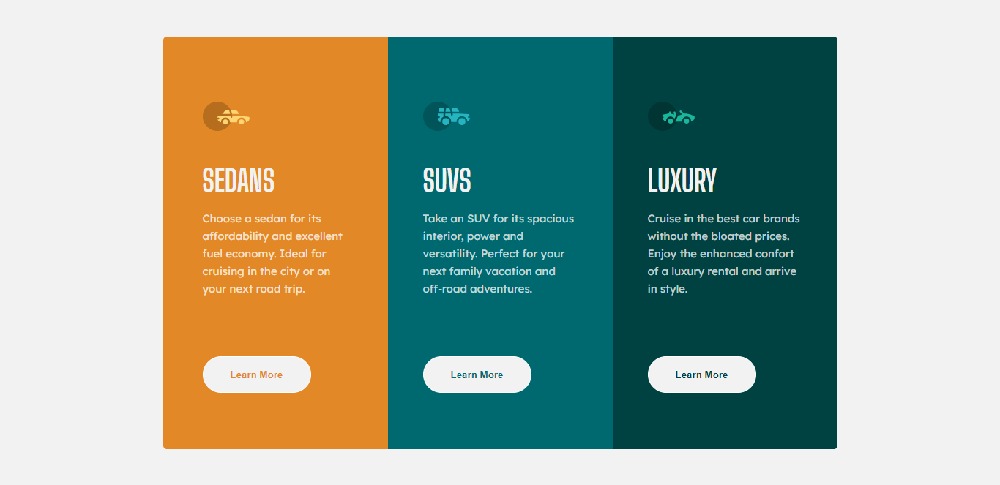

# Frontend Mentor - 3-column preview card component solution

This is a solution to the [3-column preview card component challenge on Frontend Mentor](https://www.frontendmentor.io/challenges/3column-preview-card-component-pH92eAR2-). Frontend Mentor challenges help you improve your coding skills by building realistic projects. 

## Table of contents

- [Overview](#overview)
  - [The challenge](#the-challenge)
  - [Screenshot](#screenshot)
- [My process](#my-process)
  - [Built with](#built-with)
  - [What I learned](#what-i-learned)
  - [Continued development](#continued-development)
- [Author](#author)


## Overview

### The challenge

Users should be able to:

- View the optimal layout depending on their device's screen size
- See hover states for interactive elements

### Screenshot



## My process

### Built with

- CSS custom properties
- Flexbox
- CSS Grid
- Mobile-first workflow
- [React](https://reactjs.org/) - JS library

### What I learned

With this project I was able to refresh my knowledge in CSS Grid and React. It was easy to apply and the process was very pleasant.
An example of these is the following code:

```html
    <>
     <Sedans/>
     <Suvs/>
     <Luxury/>
    </>
```

```css
.sedansContainer{
    min-height: 442px;
    background-color: hsl(31, 77%, 52%);
    border-radius: 5px 5px 0 0;
    padding: 2em 54px;
    display: grid;
    grid-template-rows: repeat(4,auto);
    align-content: center;
}
.iconContainer{
    margin-top: 13px;
}
.titleContainer{
    margin-top: 40px;
}
.textContainer{
    align-self: center;
    padding-top: 1em;
}
.btnSedan>button{
    color:hsl(31, 77%, 52%);
}

@media screen and (min-width:768px){
    .sedansContainer{
        border-radius: 5px 0 0 5px;
        min-height: 500px;
    }
}
```
This is only a module, but the others modules are literally the same.


### Continued development

In the future, I will be refactor my StyleSheets and my components for apply a pattern design and convert it in a better and scalable code.


## Author

- Website - [Constanza Malen Almendra](https://www.linkedin.com/in/constanzamalenalmendra/)
- Frontend Mentor - [@MalenAlmendra](https://www.frontendmentor.io/profile/MalenAlmendra)

